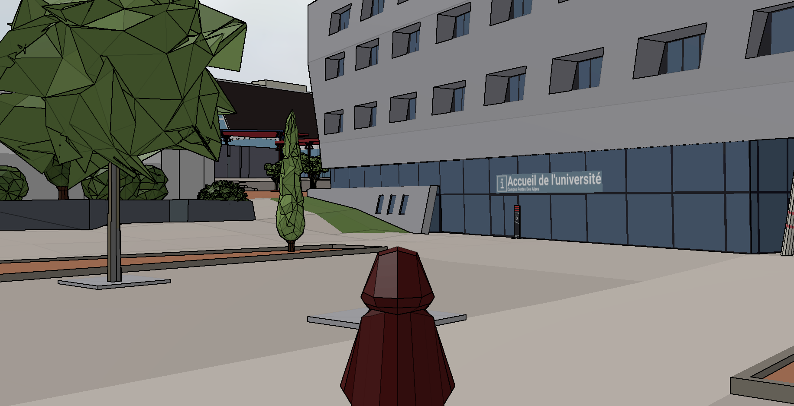

# A demo of wandering in third person at human scale in a digital mockup

This repository holds the source code of a web demonstration using the UD-Viz framework.
The university campus of *Porte des Alpes* situated in the town of Bron (near Lyon, in France) has been reproduced in a digital mockup.

This web demonstration put you in control of an avatar wandering in the digital mockup, and following a fictive student schedule.
You can find a live version of the demonstration at URL https://deambulation-bron.vcityliris.data.alpha.grandlyon.com/.

Quick start:
* The avatar is currently controlled with the keyboard keys `ZQSD` (French mapping).
* Contextual instructions are displayed at the upper left corner of the demonstration.
* The avatar spawns far from the campus, in an empty area ; to start the wandering (and the clock), press the `M` key.
* Orientation tables are scattered throughout the campus and a map is displayed when the avatar stands close those tables.
* The current objective of the student schedule is validated when the avatar reaches its area, and the next objective is revealed.
  There are 10 objectives in total, and when finished, the resulting time is displayed, and the log of the wandering (the trace of the track) can be downloaded by pressing key `T`.

# Local installation

Dependencies:
- `npm` (see [here](https://github.com/VCityTeam/UD-Viz-Template)),
- and `wget`.

Runnning the provided [`install.sh`](install.sh) script should be enough to download the required npm packages and external assets.
Then, a simple `npm run debug` starts a local web server with the demonstration accessible at URL http://localhost:8000/.

# A word on the data

The digital mockup of the campus has been modeled manually in Blender, starting from a coarse mockup of the Bron district provided as open data by the Lyon metropolis.
The open data has undergone multiple transformations between file formats and referentials.
For the sake of reproducibility, the transformations are documented here: https://github.com/VCityTeam/UD-Reproducibility/blob/master/Computations/DatAgora-Deambulation-Bron/BlenderModelingPipeline.md.

The produced assets provided in the external dataset https://dataset-dl.liris.cnrs.fr/vcity-sample-data/bron-2018-campus are:
* `campus.glb`: the detailed campus mockup with lightweight textures for the colormap and signs,
* `map.glb`: a simple quad with a map texture and bookmarks associated to orientation tables,
* `avatar_capuchon.glb`: the model of the avatar,
* `sky.jpg`: the texture used as skydome.
Please note that the avatar model and skydome texture originate from the [UD-Viz repository](https://github.com/VCityTeam/UD-Viz).
